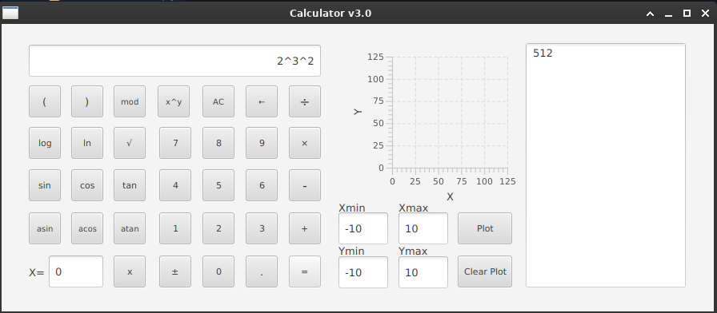

## SmartCalc v3 Java with native C++ library


Калькулятор на Java с использованием C++ библиотеки
Описание проекта

#### Этот проект представляет собой калькулятор, реализованный на Java, который использует библиотеку на C++ для выполнения математических операций. Он демонстрирует взаимодействие между Java и C++ через JNI (Java Native Interface) с использованием библиотеки JavaCPP.
Основные модули

- JavaFX: Используется для создания графического пользовательского интерфейса (GUI) калькулятора.
- JNA (Java Native Access): Используется для взаимодействия с нативной C++ библиотекой.
- C++ библиотека: Реализует основную логику вычислений, предоставляя методы для выполнения математических операций.
- FXML: Описывает интерфейс калькулятора в виде XML, что позволяет отделить логику приложения от его представления.

#### Как это работает

- Инициализация приложения: При запуске приложения загружается FXML файл, который определяет структуру пользовательского интерфейса.
- Создание модели: Используется библиотека на C++ для создания экземпляра модели, которая содержит методы для выполнения расчетов.
- Связывание модели с моделью представления: Модель представления (s21_viewmodel) получает доступ к экземпляру модели и обрабатывает ввод пользователя.
- Обработка событий: Пользовательский ввод обрабатывается в модели представления, которая вызывает соответствующие методы из C++ библиотеки для выполнения расчетов.
- Отображение результатов: Результаты вычислений отображаются в интерфейсе пользователя.

#### Запуск

```bash
mvn clean install
```